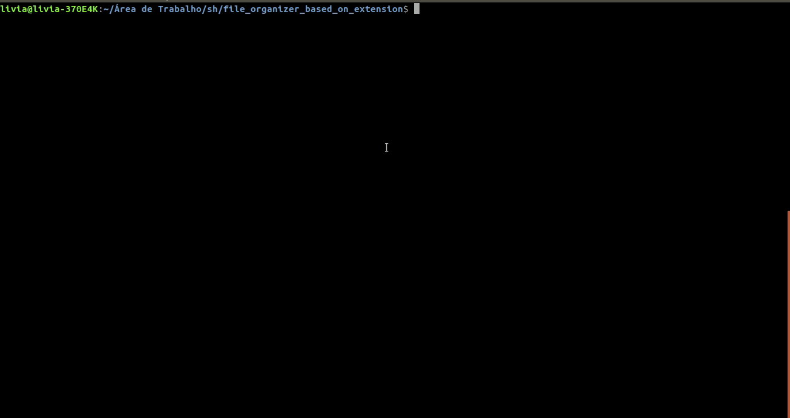

<h1> File Organizer Based on extension </h1>

 Recursively groups files into folders according to their extension 

<h2> Syntax </h2>

 sh file_organizer_based_on_extension.sh [source_folder_path] [destination_folder_path] 

<h2> Execution Example </h2>

